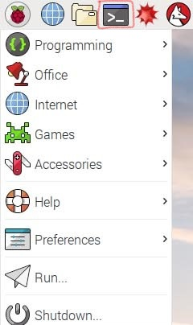

Server
======

The server is central brains of the system.  It is responsible for communicating with the RFID readers, saving data, making it viewable and more.  Each field site needs one server.  The server is designed to be a Raspberry Pi (RPi) mini computer.  These are less than \$20 and provide a full Linux interface.  It is recommended to use the Raspberry Pi Zero W as it is small, low power, inexpensive and has WiFi included but it should work with any Raspberry Pi (seen below).

Hardware
--------

Which ever RPi you decide to use, it is recommended to use a SD card with at least 16GB of space.  Your RPi might come without the pins soldered on.  If this is the case then solder the pins to the board.  Pin 1 is the closest to the middle and the SD slot and pin 2 is next to in on the other long set of pins.  You can view the Raspberry Pi pins at `pinout\.xyz <https://pinout.xyz/>`_.
In addition to the RPi you will need a radio for it and a real time clock (RTC).  The RTC allows the RPi to know what time it is, which is not possible in the field where there is no internet.  The RTC module connects to the RPi using pins 1,3,5,7,9 with pin 1 connected to the VCC (+) pin on the RTC.  Next the radio needs to be connected per the table below.

**Table showing pin connections between radio and Rapsberry Pi.**

===========  ================  ============  ===============
Power module (from module)     Capacitor (from radio)
-----------------------------  -----------------------------
nRF24 pins   Arduino pins      nRF2 pins     Arduino pins
===========  ================  ============  ===============
1. GND       Pin 20            1. GND        Pin 20
2. VCC       Pin 4             2. VCC        Pin 17
3. CE        Pin 22 (GPIO 25)  3. CE         Pin 22 (GPIO 25)
4. CSN       Pin 24            4. CSN        Pin 24
5. SCK       Pin 23 (GPIO 11)  5. SCK        Pin 23 (GPIO 11)
6. MOSI      Pin 19 (GPIO 10)  6. MOSI       Pin 19 (GPIO 10)
7. MISO      Pin 21 (GPIO 9)   7. MISO       Pin 21 (GPIO 9)
8. IRQ       Not used          8. IRQ        Not used
===========  ================  ============  ===============

The RPi should now look like this:

.. figure:: ../../images/RPi_Assembled.jpg
	:align: center

	Raspberry Pi Zero W with RTC and radio.

Software
--------

Download the zip of the NOOBs (new out of box) operating system for the Raspberry Pi found at \url{https://www.raspberrypi.org/downloads/noobs/}.  Unzip the folder and install it according the the readme instructions to setup the SD card.  This is different depending on your operating system but you need to format the SD card and then copy the extracted contents of the NOOB zip onto them.  Next you can plug the SD card into the RPi, add the RTC and radio, plug in a monitor and keyboard and then plug the power cord in.  \textbf{Make sure that you plug the power cable into the correct port (there are two that look the same on the Raspberry Pi zero W).}  Follow the steps on screen to install the operating system.  Make sure that you set the timezone, change the password, connect to WiFi and update the system.  If you have problems with this step you can refer to this video \url{https://www.youtube.com/watch?v=iJbjAJpJA84}.

Now you need to install the RFID Network software.  This can be done automatically or manually.  The manual installation instructions, which are incredibly tedious, are found in the following path: RFIDNetwork\_RPi\_install\_list.md.  For that reason you probably want to use the automatic script.  Start by opening the terminal by clicking the icon in the top left corner that is a gray rectangle with white text that looks like ">\\_" (shown below).  If you only have a key board plugged in you can click the windows key, arrow down to Accessories, arrow right, arrow down to Terminal and press enter.

The RPi should now look like this:

	RPi desktop showing terminal icon.

The terminal is a text only interface where you type commands and then run them by typing enter.  Type "wget https://bit.ly/2CCI6Ok" then press enter.  Next type "chmod +x 2CCI6Ok" and press enter.  Finally type "./2CCI6Ok" and type enter.  This will start the instillation process.  It's recommended that you type "y" when promoted to enter a yes or no answer.  You will be prompted to enter the current password for the Raspberry Pi.  This is needed to configure the database.  You will then be asked to enter an admin username and password.  This is used as the credentials for the database so you should remember it and make it secure.  After the instillation is complete, press y to reboot.  Next you can connect to the access point created by the RPi using a computer or phone.  When prompted to enter a username enter `admin` and password enter `pass`.  Then click on the settings page->Go to Admin Settings and change the admin and username password (still needs to be implemented, will be in 0.9.1).